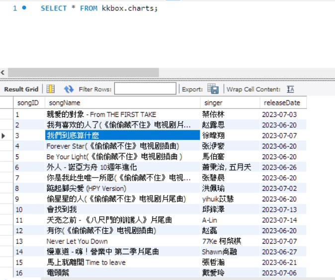

# KKBOX_fetchData

## Description
python爬蟲KKBOX每周榜單資料，存入mysql資料庫，並透過python 執行mysql search  
使用 Python 套件串接資料庫系統 mysql-connector 或 PyMySQL  

## Motivation and basics
學習透過python 建立mysql資料庫(demo_mysql_test.py) 
爬取ajax資料儲存至資料庫(KKBOX_db_py.py) 
從資料庫搜尋資料(fetch.py) 

## Installation / How to setup

### Requirement
mysql-connector-python     8.1.0 
requests                   2.31.0 

## Copy-pastable quick start code example

### scrapy by requests
  `url = "https://kma.kkbox.com/charts/api/v1/weekly?category=297&date=2023-07-20&lang=tc&limit=50&terr=tw&type=newrelease"`

  `response = requests.get(url)`  
  `data = json.loads(response.text)`
  
### connect to mysql
`db_setting = { ` 
  `'user':'root', ` 
  `'password':'8888', #請重新輸入密碼` 
  `'host':'127.0.0.1',` 
  `'database':'kkbox',` 
 ` 'raise_on_warnings':True` 
`}` 

`conn = mysql.connector.connect(**db_setting)`
### find data
**建立cursor object**
`with conn.cursor() as cursor:` 
   ` **查詢資料sql**` 
  `  command = "SELECT * FROM charts"` 
  `  **execute** ` 
 `   cursor.execute(command)` 
 
`    result = cursor.fetchall()` 
`    print(result)` 

### demo

